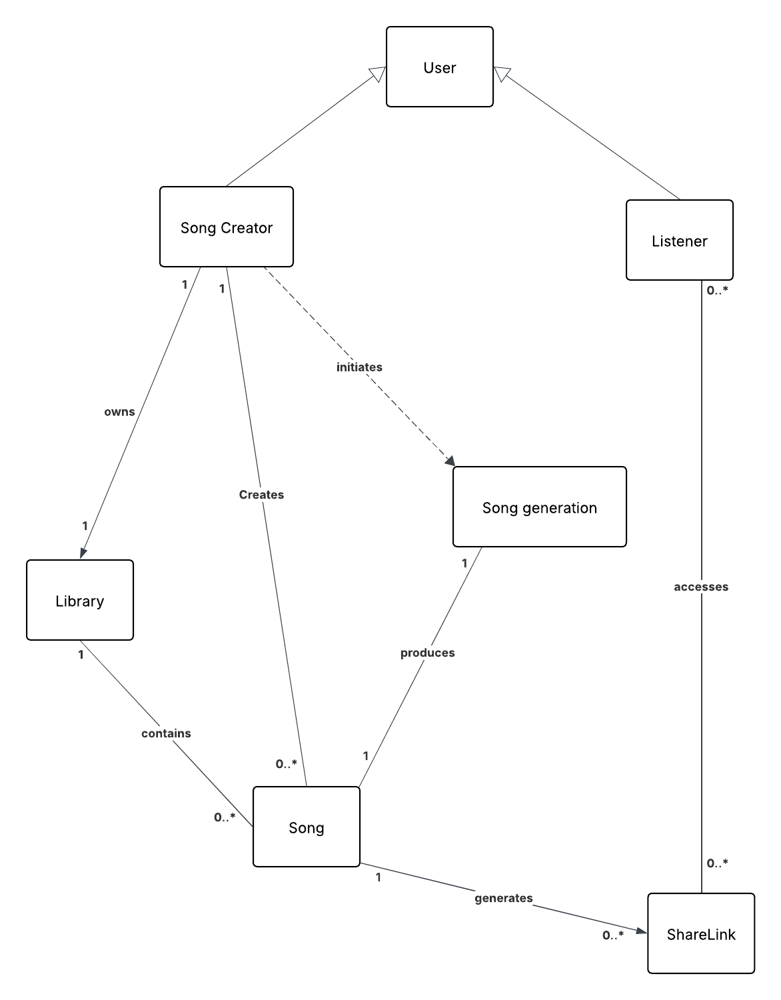
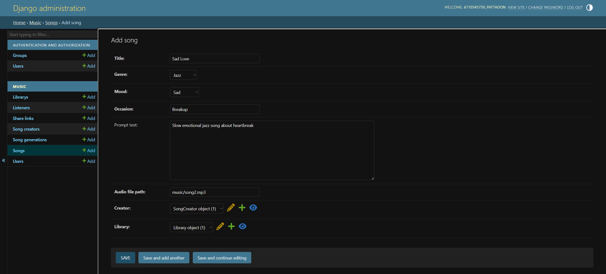
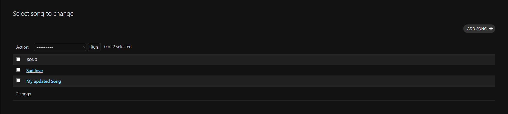
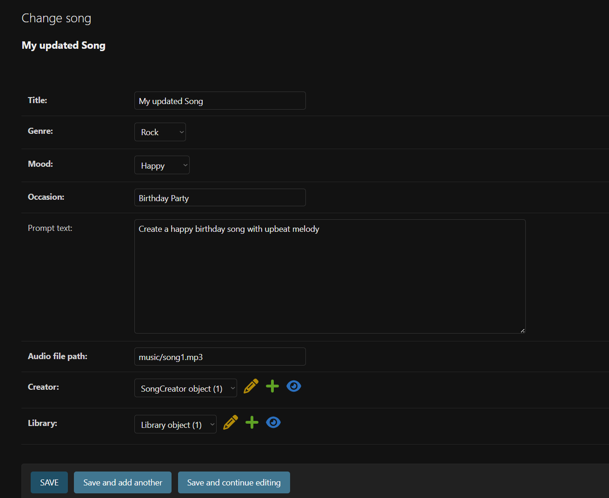
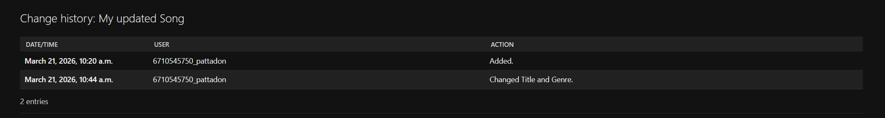
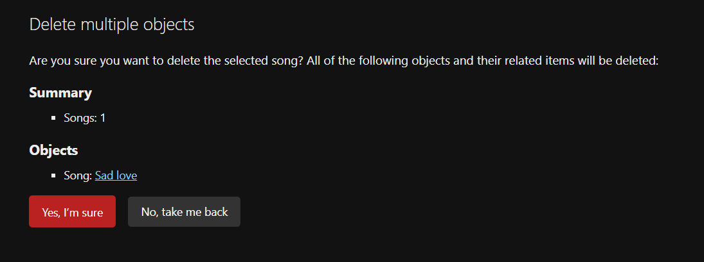
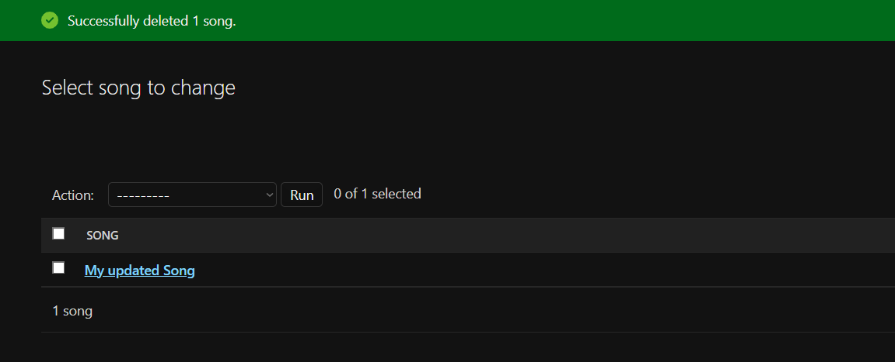

# Cithara
A Django AI-generated song web application

## Domain Model
<p align="center">
  
</p>

## Setup Virtual Environment
### Create virtual environment
#### macOS / Linux
```
python3 -m venv venv
```
#### Window
```
python -m venv venv
```
### Activate virtual environment
#### macOS / Linux
```
source venv/bin/activate
```
#### Window
```
venv\Scripts\activate
```
### Install dependencies
```
pip install -r requirements.txt
```

## How to run
### Apply database migrations
Creates database tables based on the defined models.
```
python manage.py migrate
```
### Create Superuser
Creates an admin account for accessing Django Admin.
```
python manage.py createsuperuser
```
### Run development server
Starts the local development server.
```
python manage.py runserver
```
## Access Django Admin
Open this URL in your browser: http://127.0.0.1:8000/admin

## Song Generation (Exercise 4 – Strategy Pattern)

### Setup environment variables

Copy `.env.example` to `.env` and edit the values:
```
cp .env.example .env
```

`.env` file:
```
GENERATOR_STRATEGY=mock   # mock | suno
SUNO_API_KEY=your_suno_api_key_here
```

> **Never commit `.env` to version control.** It is already listed in `.gitignore`.

---

### Run in Mock mode (offline, no API key needed)

Set `GENERATOR_STRATEGY=mock` in your `.env`, then run:
```
python manage.py demo_generation
```

Expected output:
```
Strategy: MockSongGeneratorStrategy

[Mock] Generating song: 'Demo Song' | genre=POP mood=HAPPY
Task ID : mock-a1b2c3d4
Status  : SUCCESS
Audio   : https://example.com/mock-audio.mp3

[Mock] Checking status for task: mock-a1b2c3d4
Status check → SUCCESS
Audio URL    → https://example.com/mock-audio.mp3
```

---

### Run in Suno mode (calls Suno API)

1. Get your API key from [sunoapi.org](https://sunoapi.org)
2. Set in `.env`:
   ```
   GENERATOR_STRATEGY=suno
   SUNO_API_KEY=your_actual_key_here
   ```
3. Run:
   ```
   python manage.py demo_generation
   ```

Expected output:
```
Strategy: SunoSongGeneratorStrategy

[Suno] Task created: abc123-task-id
Task ID : abc123-task-id
Status  : PENDING

[Suno] Task abc123-task-id status: SUCCESS
Status check → SUCCESS
Audio URL    → https://cdn.sunoapi.org/...mp3
```

---

## CRUD Demonstration

### 1. Create


### 2. Read


### 3. Update





### 4. Delete



