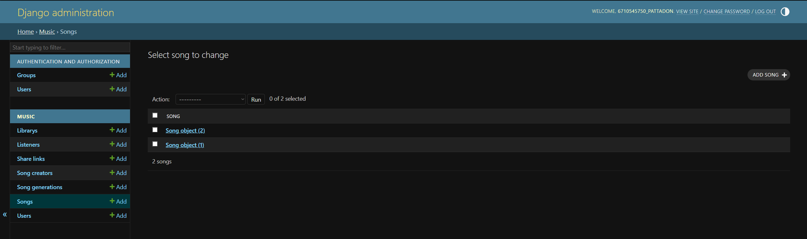
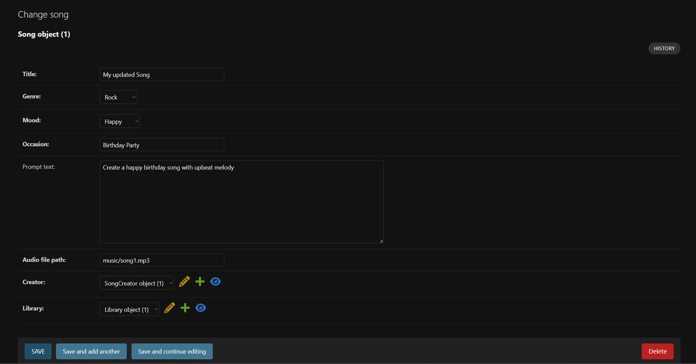
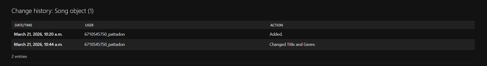
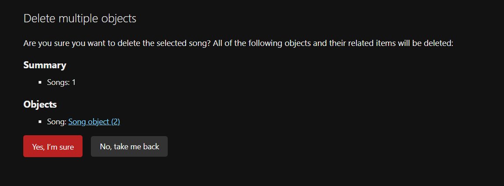

# Cithra
A Django AI-generated song web application

## Domain Model


## Setup Virtual Environment
### Create virtual environment
#### macOS / Linux
```
python3 -m venv venv
```
#### Window
```
python -m venv venv
```
### Activate virtual environment
#### macOS / Linux
```
source venv/bin/activate
```
#### Window
```
venv\Scripts\activate
```
### Install dependencies
```
pip install -r requirements.txt
```

## How to run
### Apply database migrations
Creates database tables based on the defined models.
```
python manage.py migrate
```
### Create Superuser
Creates an admin account for accessing Django Admin.
```
python manage.py createsuperuser
```
### Run development server
Starts the local development server.
```
python manage.py runserver
```
## Access Django Admin
Open this URL in your browser: http://127.0.0.1:8000/admin

## CRUD Demonstration

### 1. Create


### 2. Read


### 3. Update



### 4. Delete

