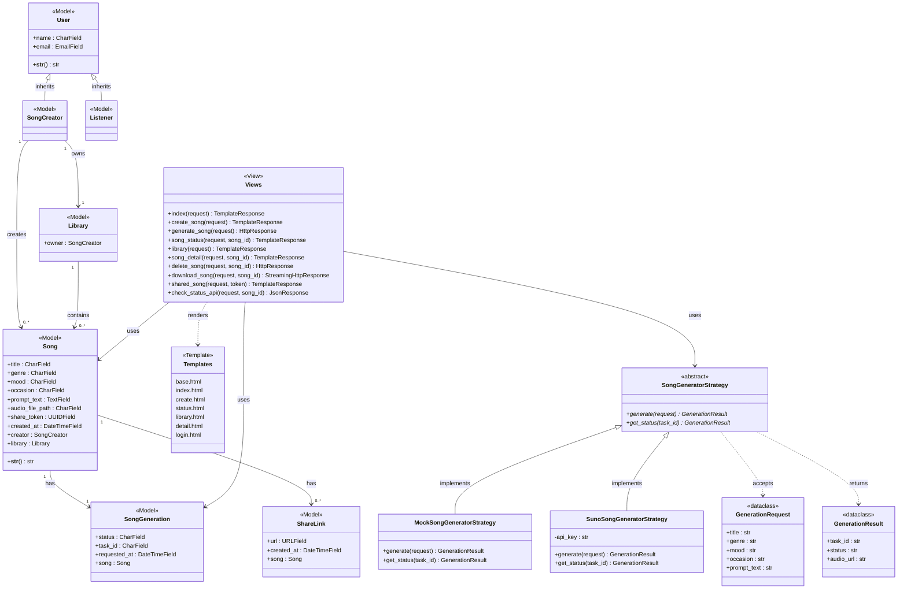

# Cithara
A Django AI-generated song web application

## Domain Model
<p align="center">
  
</p>

## Class Diagram



## Setup

### 1. Create virtual environment
#### macOS / Linux
```
python3 -m venv venv
```
#### Windows
```
python -m venv venv
```

### 2. Activate virtual environment
#### macOS / Linux
```
source venv/bin/activate
```
#### Windows
```
venv\Scripts\activate
```

### 3. Install dependencies
```
pip install -r requirements.txt
```

### 4. Set up environment variables

Copy `.env.example` to `.env` and fill in your values:
```
cp .env.example .env
```

`.env` file:
```
GENERATOR_STRATEGY=mock   # mock | suno
SUNO_API_KEY=your_suno_api_key_here

GOOGLE_CLIENT_ID=your-client-id-here
GOOGLE_CLIENT_SECRET=your-client-secret-here
```

> **Never commit `.env` to version control.** It is already listed in `.gitignore`.

### 5. Apply database migrations
```
python manage.py migrate
```

### 6. Create superuser
Creates an admin account for accessing Django Admin.
```
python manage.py createsuperuser
```

### 7. Run development server
```
python manage.py runserver
```

Open the app at: http://127.0.0.1:8000/

---

## Google OAuth Setup (Sign In with Google)

Cithara uses Google OAuth for authentication. Complete this setup after the server is running.

### 1. Create Google OAuth credentials

1. Go to [Google Cloud Console](https://console.cloud.google.com/) and create or select a project.
2. Navigate to **APIs & Services → Credentials → Create Credentials → OAuth client ID**.
3. Set Application type to **Web application**.
4. Under **Authorized redirect URIs**, add:
   ```
   http://127.0.0.1:8000/accounts/google/login/callback/
   ```
5. Copy the **Client ID** and **Client Secret** into your `.env` file.

### 2. Configure the Django Site object

After running migrations and starting the server, open Django Admin:

1. Go to http://127.0.0.1:8000/admin and log in with your superuser account.
2. Navigate to **Sites → Sites** and click the existing site (usually "example.com").
3. Set:
   - **Domain name**: `127.0.0.1:8000`
   - **Display name**: `Cithara`
4. Save.

### 3. Add the Google Social Application

Still in Django Admin:

1. Go to **Social Accounts → Social applications → Add social application**.
2. Fill in:
   - **Provider**: Google
   - **Name**: Google
   - **Client id**: *(your Google Client ID)*
   - **Secret key**: *(your Google Client Secret)*
3. Move `127.0.0.1:8000` from **Available sites** to **Chosen sites**.
4. Save.

Now "Continue with Google" on the login page will work.

---

## ngrok Setup (OAuth Testing on Public URL)

If you need to test Google OAuth via a public HTTPS URL (e.g., on a different device or when `localhost` is not accepted), use ngrok.

### 1. Install ngrok

Download from [ngrok.com/download](https://ngrok.com/download) and add it to your PATH.

### 2. Add your ngrok auth token

1. Sign up or log in at [ngrok.com](https://ngrok.com)
2. Go to **Your Authtoken** at [dashboard.ngrok.com/get-started/your-authtoken](https://dashboard.ngrok.com/get-started/your-authtoken)
3. Copy the token and run:
```
ngrok config add-authtoken <your-auth-token>
```

### 3. Start ngrok tunnel

With your Django server already running on port 8000:
```
ngrok http 8000
```

Copy the `https://` forwarding URL shown (e.g. `https://abc123.ngrok-free.dev`).

### 4. Add the ngrok URL to Google Cloud Console

In [Google Cloud Console](https://console.cloud.google.com/) → **APIs & Services → Credentials** → your OAuth client:

Add a new **Authorized redirect URI**:
```
https://<your-ngrok-subdomain>.ngrok-free.dev/accounts/google/login/callback/
```

### 5. Update the Django Site object

In Django Admin → **Sites → Sites**, update the existing site:
- **Domain name**: `<your-ngrok-subdomain>.ngrok-free.dev`
- **Display name**: `Cithara`

Now open `https://<your-ngrok-subdomain>.ngrok-free.dev/` in your browser and Google OAuth will work correctly.

> **Note:** ngrok free-tier URLs change every time you restart ngrok. Repeat steps 3–5 each session.

---

## Song Generation

### Run in Mock mode (offline, no API key needed)

Set `GENERATOR_STRATEGY=mock` in your `.env`, then run:
```
python manage.py demo_generation
```

Expected output:
```
Strategy: MockSongGeneratorStrategy

[Mock] Generating song: 'Demo Song' | genre=POP mood=HAPPY
Task ID : mock-58639109
Status  : SUCCESS
Audio   : https://example.com/mock-audio.mp3

Status check : SUCCESS
Audio URL    : https://example.com/mock-audio.mp3
```

---

### Run in Suno mode (calls Suno API)

1. Get your API key from [sunoapi.org](https://sunoapi.org)
2. Set in `.env`:
   ```
   GENERATOR_STRATEGY=suno
   SUNO_API_KEY=your_actual_key_here
   ```
3. Run:
   ```
   python manage.py demo_generation
   ```

Expected output:
```
Strategy: SunoSongGeneratorStrategy

[Suno] Task created: abc123-task-id
Task ID : abc123-task-id
Status  : PENDING
```

4. Check status of an existing task (Suno generation is async — use the Task ID from the previous run):
   ```
   python manage.py demo_generation --task-id abc123-task-id
   ```

Expected output:
```
Strategy: SunoSongGeneratorStrategy

[Suno] Task abc123-task-id status: SUCCESS
Task ID : abc123-task-id
Status  : SUCCESS
Audio   : https://tempfile.aiquickdraw.com/r/<file-id>.mp3
```

---
