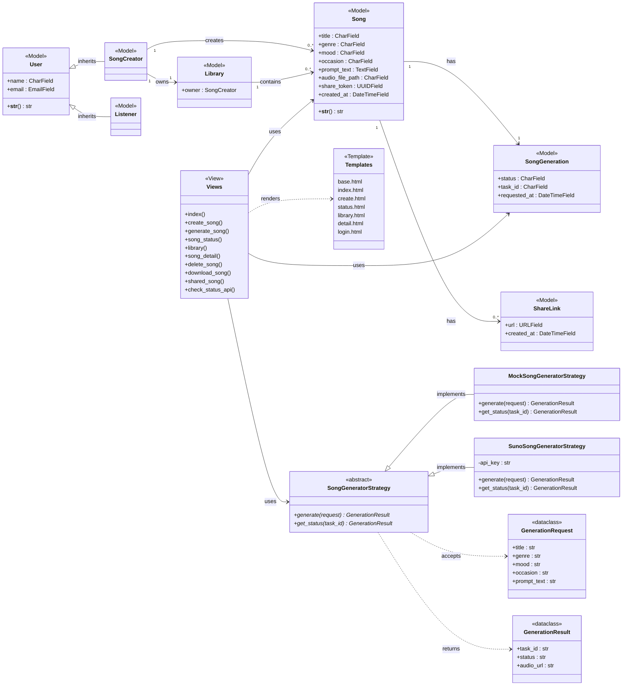

# Class Diagram

This diagram shows the full class structure of Cithara following the **Model-View-Template (MVT)** architecture pattern, along with the **Strategy Pattern** used for song generation.

## Layers

- **Model Layer** — Django ORM classes representing the domain entities. `User` is the base class inherited by `SongCreator` and `Listener`. `Song` is the central entity linked to `Library`, `SongGeneration`, and `ShareLink`.
- **View Layer** — Django view functions that handle HTTP requests, interact with models, and trigger song generation.
- **Template Layer** — HTML templates rendered by the views and served to the browser.
- **Strategy Pattern** — `SongGeneratorStrategy` defines the abstract interface for song generation. `MockSongGeneratorStrategy` is used for offline testing; `SunoSongGeneratorStrategy` calls the real Suno API.

