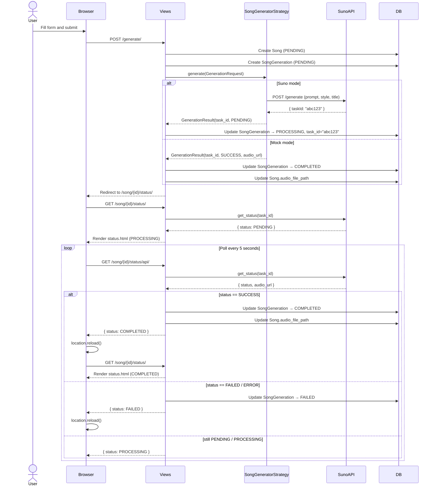

# Sequence Diagram – Song Generation Use Case

This diagram shows the end-to-end flow when a user generates a song, from form submission through to playback.

## Flow Overview

1. **Form submission** — The user fills in the create form and submits. The view creates a `Song` and `SongGeneration` record, then delegates to `SongGeneratorStrategy`.
2. **Strategy dispatch** — In **Suno mode**, the strategy calls the Suno API and receives a `taskId`. The generation status is set to `PROCESSING`. In **Mock mode**, the result is returned immediately and status is set to `COMPLETED`.
3. **Status polling** — The browser is redirected to the status page. A JavaScript `setInterval` polls `/song/{id}/status/api/` every 5 seconds. Each poll triggers a server-side check against the Suno API.
4. **Completion** — Once Suno returns `SUCCESS`, the `SongGeneration` status is updated to `COMPLETED` and the audio URL is saved. The browser reloads and renders the completed state.

